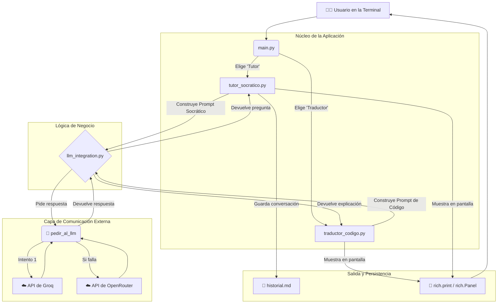
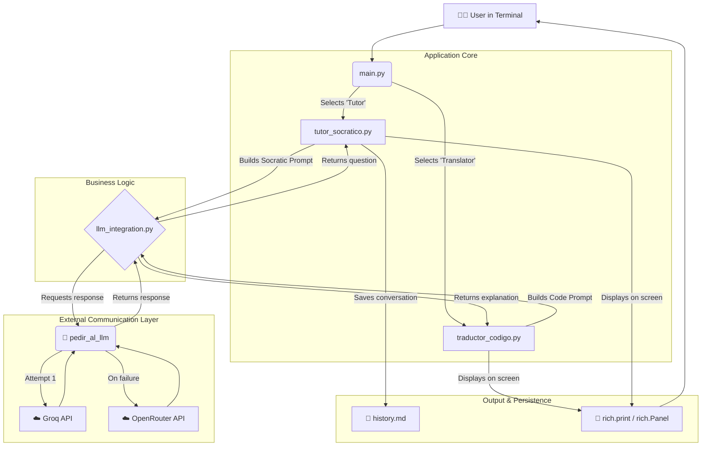

<div align="center">
  
  <h1>sh-e-llm</h1>
  <p><strong>Un Asistente de Estudio Inteligente en la Terminal, Potenciado por LLMs.</strong></p>
  <p><i>La terminal se encuentra con la inteligencia. Una shell con alma.</i></p>
  <br>
</div>

> **Nota:** Este `README.md` ha sido generado con la asistencia de un Modelo de Lenguaje Grande (LLM) para estructurar y describir el proyecto, siguiendo las directrices del desarrollador.

---

<details>
<summary><h2>🇪🇸 Ver README en Español</h2></summary>

## ✨ Características Principales

-   🧠 **Modo Tutor Socrático:** Inicia una sesión de estudio sobre cualquier tema. El LLM te guiará con preguntas, fomentando el razonamiento crítico en lugar de darte respuestas directas.
-   ↔️ **Modo Traductor de Código:** ¿Encontraste un fragmento de código confuso? Pégalo y `sh-e-llm` te proporcionará una explicación detallada, paso a paso, ideal para principiantes.
-   💾 **Historial de Conversación:** Todas las sesiones de tutoría se guardan automáticamente en archivos Markdown (`.md`), creando un valioso registro de tu aprendizaje para futuras consultas.
-   🎨 **Interfaz Atractiva:** Construido con la librería `rich` de Python para una experiencia de usuario colorida, limpia y moderna en la terminal.
-   🔄 **Sistema de Respaldo (Fallback):** Utiliza la API de Groq para respuestas ultra rápidas, con OpenRouter como respaldo automático para garantizar la disponibilidad.

## 🏛️ Arquitectura y Flujo de Datos

El proyecto sigue una arquitectura modular simple, diseñada para ser legible, mantenible y fácil de entender. La separación de responsabilidades es clave.


*Este diagrama muestra cómo el `main.py` actúa como un director de orquesta, pasando el control a los módulos específicos. Toda la comunicación con las APIs de LLMs está centralizada en `llm_integration.py`, que a su vez maneja la lógica de respaldo. La salida al usuario y la persistencia de datos son los pasos finales del flujo.*

## 🚀 Cómo Empezar

Sigue estos pasos para ejecutar `sh-e-llm` en tu máquina local.

### 1. Prerrequisitos

-   Python 3.8 o superior.
-   Una cuenta en [Groq](https://console.groq.com/keys) y/o [OpenRouter](https://openrouter.ai/keys) para obtener tus claves de API.

### 2. Instalación

1.  **Clona el repositorio:**
    ```bash
    git clone https://github.com/tu-usuario/sh-e-llm.git
    cd sh-e-llm
    ```

2.  **Crea y activa un entorno virtual:**
    ```bash
    # En Mac/Linux
    python3 -m venv venv
    source venv/bin/activate

    # En Windows
    python -m venv venv
    .\venv\Scripts\activate
    ```

3.  **Instala las dependencias:**
    ```bash
    pip install -r requirements.txt
    ```

### 3. Configuración

1.  Crea un archivo llamado `.env` en la raíz del proyecto.
2.  Añade tus claves de API al archivo `.env`. Puedes usar una o ambas.

    ```ini
    # .env
    GROQ_API_KEY="gsk_tuClaveSecretaDeGroq"
    OPENROUTER_API_KEY="sk-or-v1-tuClaveSecretaDeOpenRouter"
    ```

### 4. Ejecución

¡Ya está todo listo! Ejecuta la aplicación con:
```bash
python main.py
```
Aparecerá el menú principal para que puedas empezar a estudiar.

## 🛠️ Tecnologías Utilizadas

-   **[Python](https://www.python.org/)**: El lenguaje principal del proyecto.
-   **[rich](https://github.com/Textualize/rich)**: Para crear interfaces de línea de comandos hermosas y expresivas.
-   **[requests](https://requests.readthedocs.io/)**: Para realizar llamadas HTTP a las APIs de los LLMs de forma simple y robusta.
-   **[python-dotenv](https://github.com/theskumar/python-dotenv)**: Para gestionar las claves de API y otros secretos de forma segura.

</details>

---

<details>
<summary><h2>🇬🇧 View README in English</h2></summary>

## ✨ Main Features

-   🧠 **Socratic Tutor Mode:** Start a study session on any topic. The LLM will guide you with questions, encouraging critical thinking instead of giving you direct answers.
-   ↔️ **Code Translator Mode:** Found a confusing code snippet? Paste it in, and `sh-e-llm` will provide a detailed, step-by-step explanation, perfect for beginners.
-   💾 **Conversation History:** All tutoring sessions are automatically saved to Markdown (`.md`) files, creating a valuable record of your learning for future reference.
-   🎨 **Attractive Interface:** Built with Python's `rich` library for a colorful, clean, and modern user experience in the terminal.
-   🔄 **Fallback System:** Uses the Groq API for ultra-fast responses, with OpenRouter as an automatic backup to ensure availability.

## 🏛️ Architecture and Data Flow

The project follows a simple, modular architecture designed to be readable, maintainable, and easy to understand. Separation of concerns is key.


*This diagram shows how `main.py` acts as an orchestrator, passing control to specific modules. All communication with LLM APIs is centralized in `llm_integration.py`, which in turn handles the fallback logic. User output and data persistence are the final steps in the flow.*

## 🚀 Getting Started

Follow these steps to run `sh-e-llm` on your local machine.

### 1. Prerequisites

-   Python 3.8 or higher.
-   An account on [Groq](https://console.groq.com/keys) and/or [OpenRouter](https://openrouter.ai/keys) to get your API keys.

### 2. Installation

1.  **Clone the repository:**
    ```bash
    git clone https://github.com/tu-usuario/sh-e-llm.git
    cd sh-e-llm
    ```

2.  **Create and activate a virtual environment:**
    ```bash
    # On Mac/Linux
    python3 -m venv venv
    source venv/bin/activate

    # On Windows
    python -m venv venv
    .\venv\Scripts\activate
    ```

3.  **Install the dependencies:**
    ```bash
    pip install -r requirements.txt
    ```

### 3. Configuration

1.  Create a file named `.env` in the project's root directory.
2.  Add your API keys to the `.env` file. You can use one or both.

    ```ini
    # .env
    GROQ_API_KEY="gsk_yourSecretGroqKey"
    OPENROUTER_API_KEY="sk-or-v1-yourSecretOpenRouterKey"
    ```

### 4. Execution

You're all set! Run the application with:
```bash
python main.py
```
The main menu will appear, and you can start studying.

## 🛠️ Technologies Used

-   **[Python](https://www.python.org/)**: The core language of the project.
-   **[rich](https://github.com/Textualize/rich)**: For creating beautiful and expressive command-line interfaces.
-   **[requests](https://requests.readthedocs.io/)**: For making simple and robust HTTP requests to LLM APIs.
-   **[python-dotenv](https://github.com/theskumar/python-dotenv)**: For managing API keys and other secrets securely.

</details>
